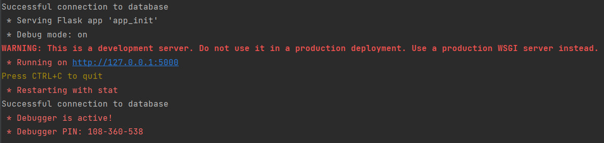
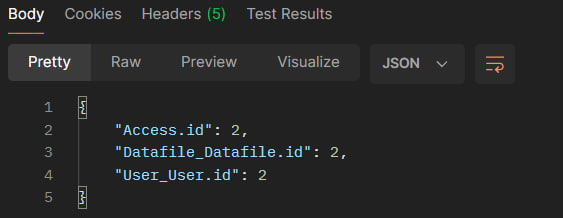
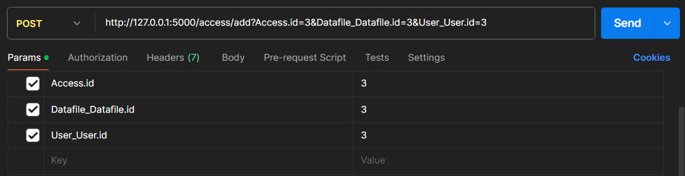
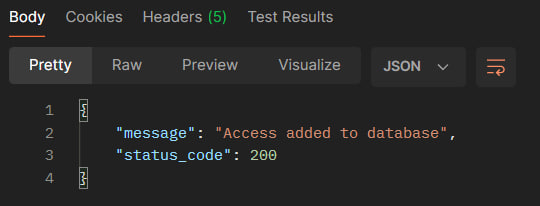
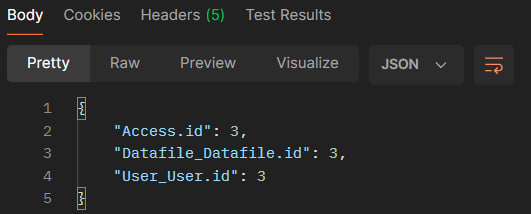
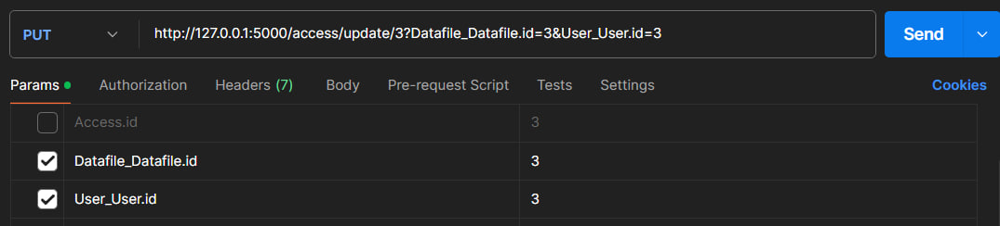
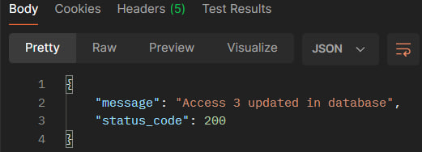
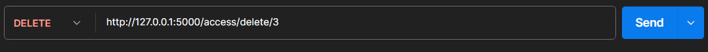
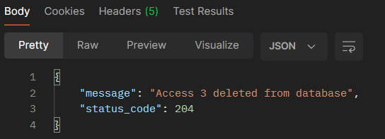

# Тестування працездатності системи

*В цьому розділі вказуються засоби тестування, наводяться вихідні коди тестів та результати тестування.*  
*Тестування виконується за допомогою Postman*

## Запуск сервера

## Тестування GET

### Отримати всіх доступів

#### Запит:

#### Результат:

### Отримати доступу по id

#### Запит:

#### Результат:

## Тестування POST

### Додати доступ

#### Запит:

#### Результат:

#### Перевірка за допомогою GET:

## Тестування PUT

### Змінити доступ по id

#### Запит:

#### Результат:

## Тестування DELETE

### Видалити доступ по id

#### Запит:

#### Результат:

#### Перевірка за допомогою GET:

